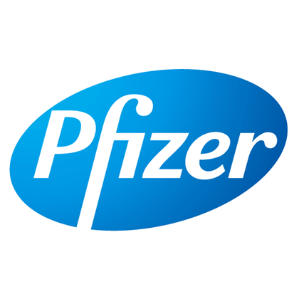
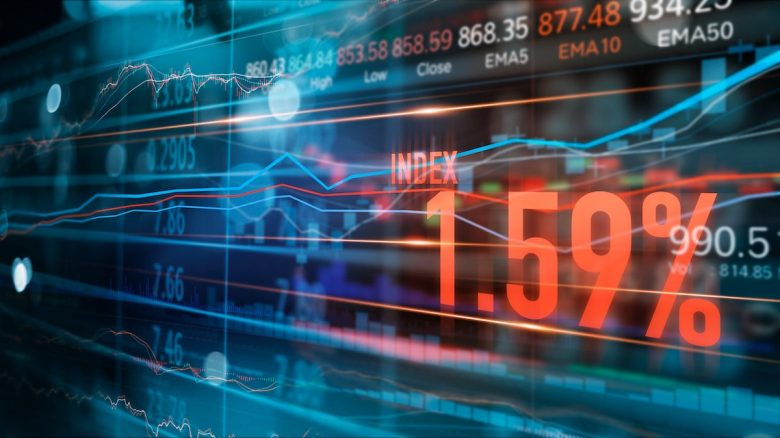
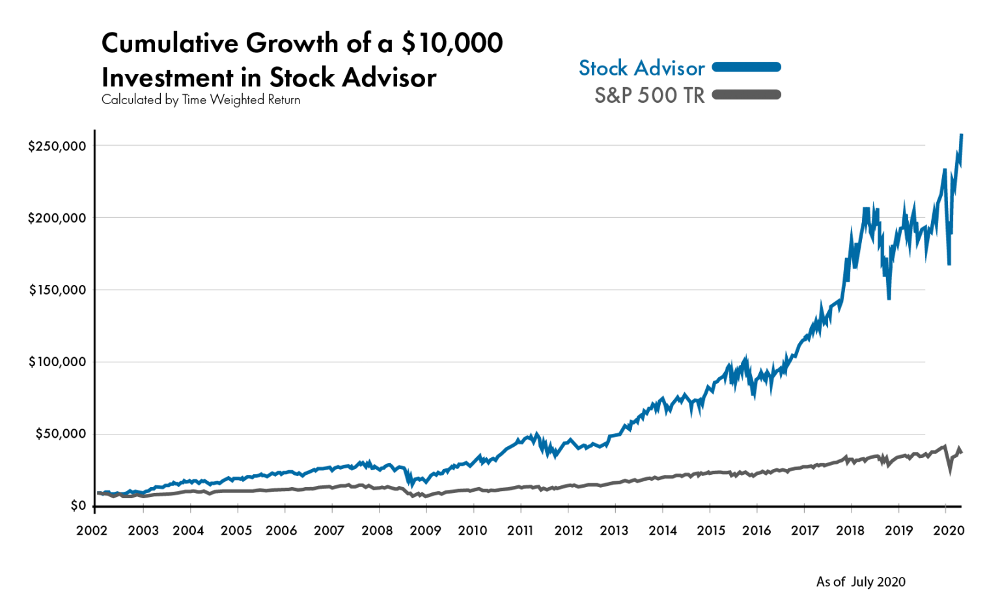

# **TraderbotAdviser**

### **Contributors : Alpa Sheladia, Brian Withrow, Lee R. Redfearn, Mischelle Massey, Nathan Bratz**
                                           

The purpose of this project is to predict future stock movement using convolutional neural network Model which allows the User to choose a company from the S&P 500 to predict the price movement of a company's stock on the next trading move based on current sentiment (Vader) from Google news articles related to such company.

Looking for executable orders using automated pre-programmed trading instructions accounting for variables such as time, price, sentiment from news media, and volume.
You've come to the right place, we'll have your back using vix score volitality measurement to decide whether to buy, sell or hold on to your investment in various industries. In this project, we'll be comparing prices from latest quaters of following corporation to build algorethmic robo advisor that can guide you with your investment insequrities. it'll research new media and past stock pattern to come up with the best decision for your stock invesment so you don't have to spand time following market. our bot will be equip for trading attempts to leverage the speed and computational resources of computers relative to human traders. According to Walstreet jornal article, A study in 2019 showed that around 92% of trading in the Forex market was performed by trading algorithms rather than humans.

Focusing on some of the most volatile industries as below. 

 

#### **Indutries:**

Airline = American Airline (AAL)
Tech = Apple (AAPL)
Oil & Gas = Exxon (XOM)
Crypto = Bitcoin (BTC)  
Medical = pfizer (PFE)
media = Zoom(ZM)

#### NOTE: You must have active keys from the following APIs to run this program:

  IEX Finance: https://iexcloud.io/
  News API: https://newsapi.org/
  Alpha Vantage: https://www.alphavantage.co/
  Yahoo Finance: https://finance.yahoo.com/quote/API/
  google News :https://newsapi.org/s/google-news-api
  news paper 3K: https://newspaper.readthedocs.io/en/latest/user_guide/advanced.html

#### **Possible New Metrics/Tools to Use:**

●Cross Validation (Better estimation of test error)

●Use nltk and tensorflow for neural networks on natural language processing
●Graph performance results using multiple layers, ​network types​ and ​learning rates
● Googlenews API 
●YahooFinance
● we used training a 2D-convolutional neural network
● we used Loughran-McDonald Master Dictionary to get sentiment 
● We made new class stockscurb to collect, organized data for the assets.

## **TraderbotAdvisor** 

 

#### **Questions to be solved by the end of the project:**

● what are your findings of the news media's contribution in the stock market volatility over past three-four years?

We used several features and academic research to figure out that media plays crucial role in market volatility. We redefine sentiment and multivarient to extrect data from news articles to see the affect on future prices of stocks.
 

● Is this a supervised or unsupervised learning task? what are data features and what is the target variable? If unsupervised, what are the data features and what do we hope to find?
 This is supervised learning task since the data is provided with target variable is next day's price . Data features include prameters, prices,VIX, Sentiment, Closingprice and Volume. 

● How did the Machine learning played role in it?
In deep learning, a convolutional neural network is a class of deep neural networks, most commonly applied to analyzing visual imagery. They are also known as shift invariant or space invariant artificial neural networks, based on their shared-weights architecture and translation invariance characteristics. We repurposed it to multivarious signal to get readable result in order to incorporate the information from all features and identifies the feature significant to predict the price for next day. 

